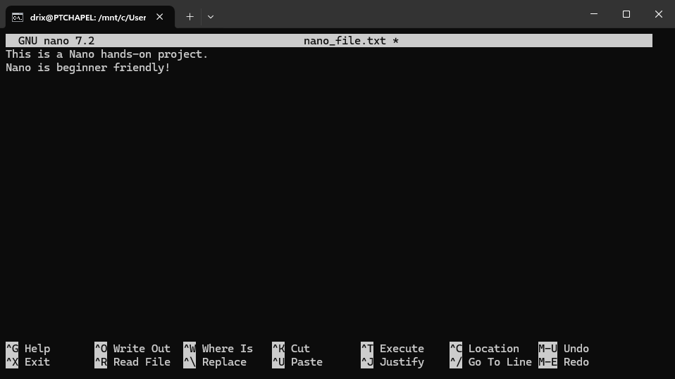

# Linux-Text-Editors# Linux Text Editors

This document provides evidence of my hands-on experience with two Linux text editors: **Vim** and **Nano**, as part of my DevOps learning journey.

---

## ✅ Vim Text Editor Task

### Step 1: Create and Open a File
```bash
vim exercise.txt
```
This command created the file `exercise.txt` (if it didn’t already exist) and opened it in Vim.  


---

### Step 2: Enter Insert Mode and Type Text
- Pressed `i` to enter Insert Mode.
- Typed:
```
Hello, this is a Vim hands-on project.
Welcome to darey.io.
```


---

### Step 3: Navigate Through the Text
- Used arrow keys and Vim navigation keys:
  - `h`, `j`, `k`, `l` to move left, down, up, and right respectively.  

---

### Step 4: Delete a Character
- Pressed `Esc` to enter Normal Mode.
- Moved cursor to a character and pressed `x` to delete.  
''

---

### Step 5: Delete a Line
- Pressed `Esc`.
- Moved to the desired line and pressed `dd`.  


---

### Step 6: Undo Changes
- Pressed `u` in Normal Mode to undo last change.  


---

### Step 7: Save and Exit Vim
```vim
:wq
```


---

### Step 8: Quit Without Saving (Demonstration)
```vim
:q!
```


---

## ✅ Nano Text Editor Task

### Step 1: Create and Open File
```bash
nano nano_file.txt
```


---

### Step 2: Type Text into File
Typed:
```
This is a Nano hands-on project.
Nano is beginner friendly!
```


---

### Step 3: Save File
- Pressed `Ctrl + O` to save.
- Pressed `Enter` to confirm filename.  


---

### Step 4: Exit Nano
- Pressed `Ctrl + X`.  


---

### Step 5: Open Existing File
```bash
nano nano_file.txt
```
- Navigated using arrow keys.
- Edited content and saved again using `Ctrl + O` > `Enter`.  

---

## ✅ conclusion

This mini project helped me become more familiar with Linux text editors. I’ve learned the basics of Vim and Nano, performed editing tasks, saved files, and exited both editors using their respective commands.
